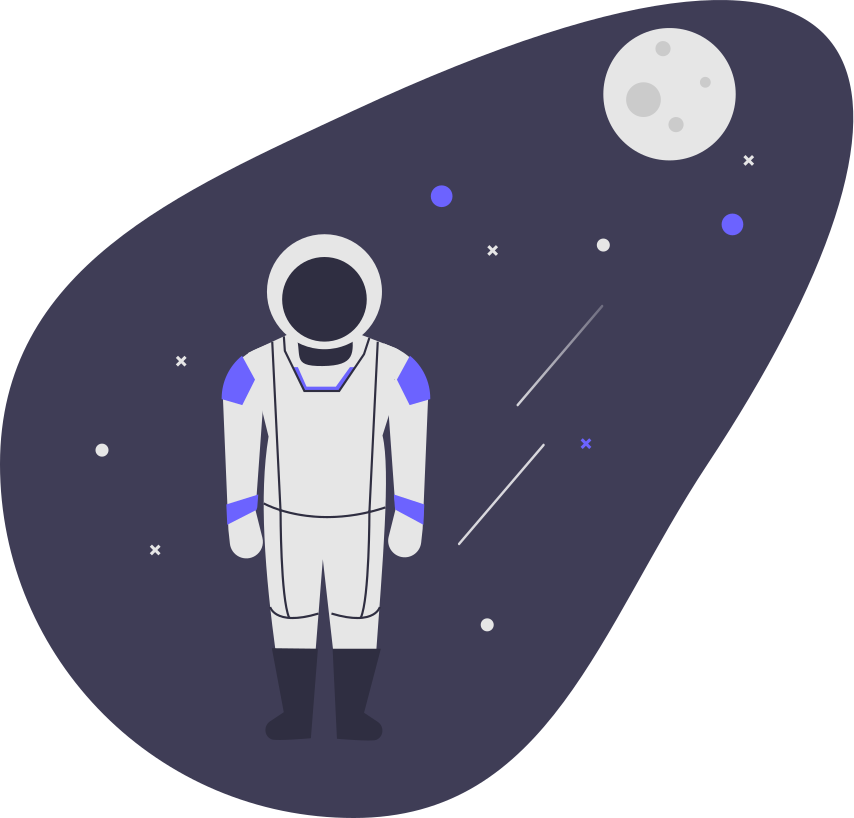
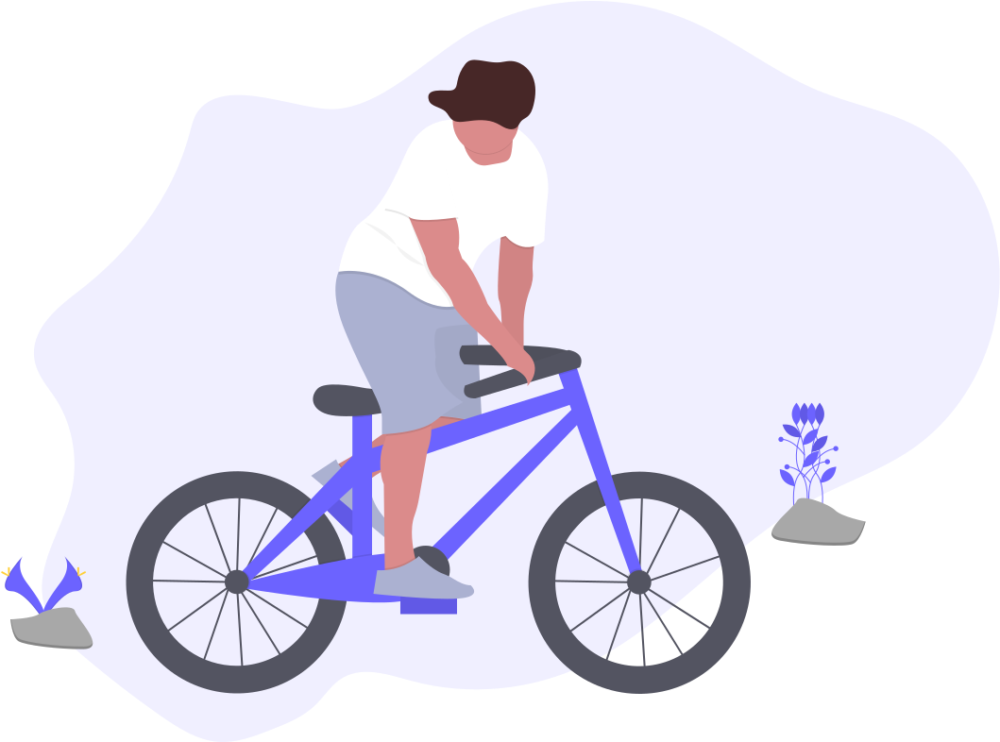
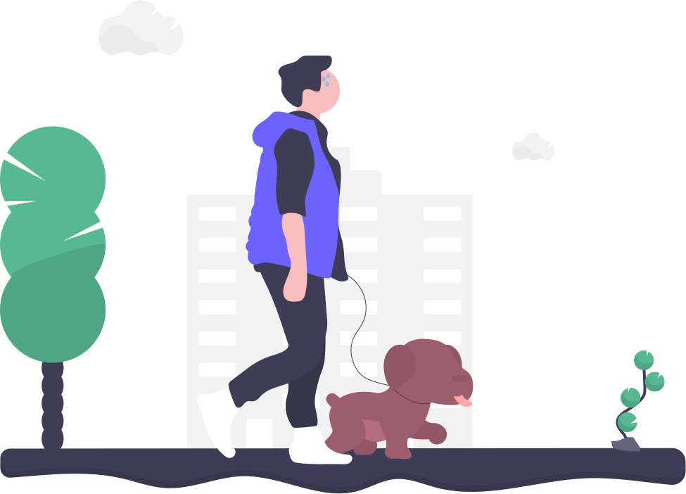

# Exploring Web Animations

[](https://app.netlify.com/sites/wonderful-allen-a7abc5/deploys)

Project exploring adding CSS animation to SVGs and using the [Web Animations API](https://developer.mozilla.org/en-US/docs/Web/API/Web_Animations_API).

|||
|:-:|:-:|
|||
||

SVG images from [undraw.co](https://undraw.co/)

---

## Demo

A live demo of the animations can be found [here](https://wonderful-allen-a7abc5.netlify.app/).

## Project setup

```bash
npm install
```

### Compiles and hot-reloads for development

```bash
npm run serve
```

### Compiles and minifies for production

```bash
npm run build
```

### Lints and fixes files

```bash
npm run lint # lint js and styles
npm run lint:fix # lint and auto-fix js and styles
```

### Customize configuration

See [Configuration Reference](https://cli.vuejs.org/config/).
